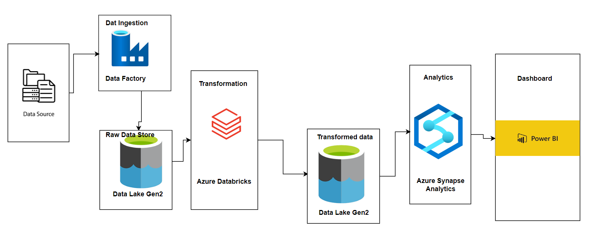
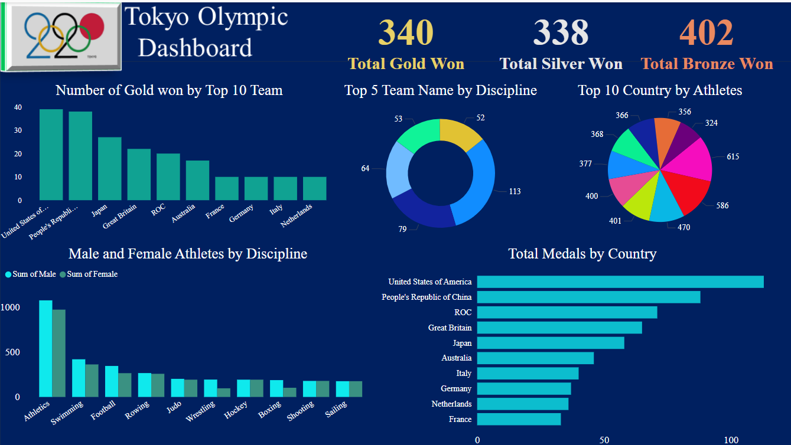

# Tokyo Olympic Games Data Engineering Project

# Project Overview
The goal of this project is to build a robust data pipeline that ingests raw Olympic data, transforms it into a structured format, and stores it in a data lake. The pipeline leverages Azure Databricks for data analysis and generates insights, which are visualized in an interactive Power BI dashboard.

# Architecture
The project follows a modern data engineering architecture on Azure, utilizing the following services:

# Data Ingestion
Data Source: Raw Olympic data sourced from publicly available datasets (e.g., CSV files).
Azure Data Factory: Orchestrates the data ingestion process, extracting data from the source and loading it into the raw data store.
 
Data Storage
Azure Data Lake Gen2: Central repository for both raw and transformed data, providing a scalable and cost-effective storage solution for large datasets.
 
Data Transformation

Azure Databricks: Spark-based analytics service that performs data cleaning, transformation, and enrichment on the raw data, converting it into a structured format suitable for analysis.
 
Data Analysis

Azure Synapse Analytics: Unified platform for data warehousing and big data analytics, used to perform complex queries and generate insights from the transformed data.
 
Data Visualization

Power BI: Business intelligence tool that creates interactive dashboards and reports to visualize the analyzed data. The dashboard provides insights into medal standings, athlete demographics, and other key performance indicators.
 

# Data Pipeline
The data pipeline consists of the following steps:
 
Data Extraction: Azure Data Factory extracts raw Olympic data from the source datasets.
 
Data Loading: Extracted data is loaded into the raw data store in Azure Data Lake Gen2.
 
Data Transformation: Azure Databricks transforms the raw data into a structured format, cleaning and enriching it as needed.
 
Data Storage: Transformed data is stored in a dedicated folder within Azure Data Lake Gen2.
 
Data Analysis: Azure Synapse Analytics queries the transformed data to generate insights and answer specific business questions.
 
Data Visualization: Power BI connects to the analyzed data and creates interactive dashboards and reports.
 

# Dashboard Insights

The Power BI dashboard provides a comprehensive view of the Olympic data, including:

 
Medal Standings: The United States leads in gold medals with 40, followed by China and Japan.
 
Total Medals by Country: The United States, China, and ROC (Russian Olympic Committee) are the top three countries in terms of total medals won.
 
Top 10 Countries by Athletes: The United States has the highest number of athletes, followed closely by Japan and China.
 
Male and Female Athletes by Discipline: Athletics has the highest number of participants, with a nearly equal distribution of male and female athletes.
 
Top 5 Teams by Discipline: The top disciplines in terms of team participation include Athletics, Swimming, and Football.

# Detailed Insights

Medal Distribution:
 
The United States has a total of 113 medals, leading the medal tally.
China follows with 88 medals, while ROC has 71 medals.
The distribution showcases the dominance of these countries in various sports.
Athlete Demographics:
 
Athletics, Swimming, and Football are the top disciplines with the highest participation.
Gender distribution is fairly balanced, with slight variations in specific disciplines.
Performance by Country:
 
The top 10 countries have a significant number of athletes, indicating a strong participation rate.
Countries like Japan and Great Britain also have a notable presence in terms of both athletes and medals won.
 

# Conclusion

This project demonstrates the use of Azure cloud services to build an efficient and scalable data pipeline for analyzing and visualizing Olympic Games data. The interactive Power BI dashboard provides valuable insights into various aspects of the data, making it a powerful tool for stakeholders.